# John the Ripper: The Basics 🛡️

Welcome to my write-up for the **"John the Ripper: The Basics"** room on TryHackMe. This room introduces key cryptographic concepts and demonstrates how to crack hashes using one of the most powerful tools in cybersecurity: **John the Ripper**.

---

## ♟️ Take Aways

- What are hashes, and why are they important?
- Why hashes are considered "one-way" functions
- How password hashes can be cracked using dictionary attacks
- How to use **John the Ripper** for hash cracking


💡 Note: This write-up starts from Task 4, where the actual hands-on usage of the John the Ripper tool begins. Earlier tasks cover theory or setup steps, but Task 4 onwards dives into practical password cracking exercises.

---

##  ♟️ What is a Hash?
 A **hash** is a fixed-length string generated from data of any size using a **hashing algorithm**. Hashes are used to **protect sensitive information** like  passwords by masking the original value.
Features:
-  One-way (can’t be reversed)
-  Fixed in size (regardless of input)
-  Unique (small changes produce completely different hashes)
  
---
## ♟️ Why are hashes secure?
Hashes are considered secure because they are one-way functions—easy to compute but nearly impossible to reverse. 
Even a small change in input produces a completely different output, making it hard for attackers to guess the original data.

## ♟️ Dictonary attacks

> Take a wordlist of possible passwords

> Hash each one

> Compare it to the target hash

> If a match is found — password cracked ✅

## ♟️ rockyou.txt
rockyou.txt is a popular wordlist file that contains millions of common passwords. It’s often used in password-cracking tools like John the Ripper to guess weak passwords during dictionary attacks.

## ♟️ John The Ripper
John the Ripper is a tool used to crack passwords by guessing them from a list of common passwords. It supports dictionary, brute-force, and hybrid attacks across various hash types.

## ♟️ Task 4 : Cracking Basic Hashes

### 1. What type of hash is `hash1.txt`?
To identify the hash type 🔍:

1. Navigate to the `task04` directory.
2. Use the following command to display the contents of the file:
    ```bash
    cat hash1.txt
    ```
3. Note down the hash value displayed.
4. Run the following command to identify the hash type:
    ```bash
    python3 hash-id.py
    ```
5. Provide the noted hash value when prompted.

As you can see from the output below, the hash type is identified as **MD5**:

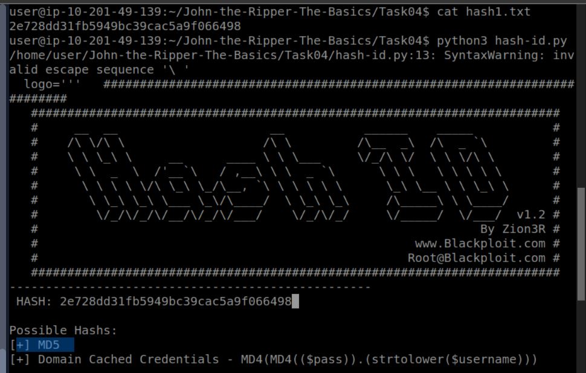

### 2.What is the cracked value of `hash1.txt`?

1. Navigate to the directory where `hash1.txt` resides and run the following command:

```bash
john --format=raw-md5 --wordlist=/usr/share/wordlists/rockyou.txt hash1.txt
```
As you can see from the command's output, the cracked password is:
`biscuit`
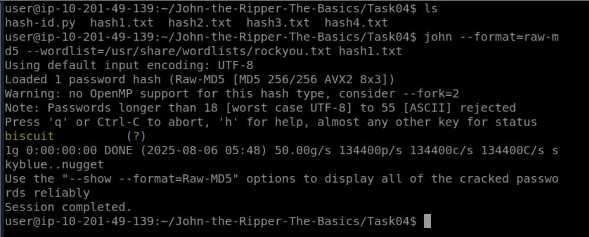

#### In a similar way , find the hash types and crack the passwords for the other files as well.

### 3. What type of hash is `hash2.txt`?
 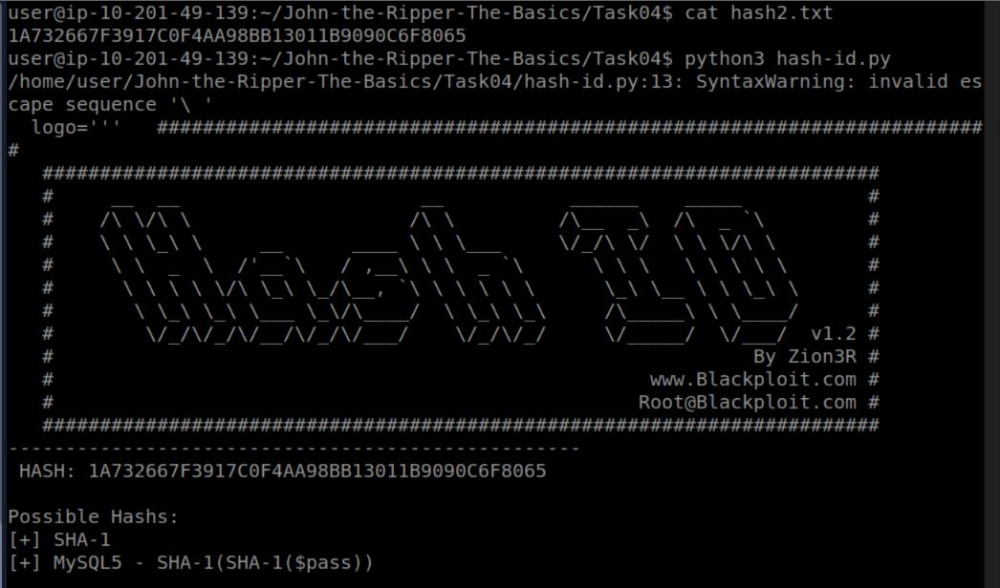

### 4.What is the cracked value of `hash2.txt`?
 

### 5. What type of hash is `hash3.txt`?
 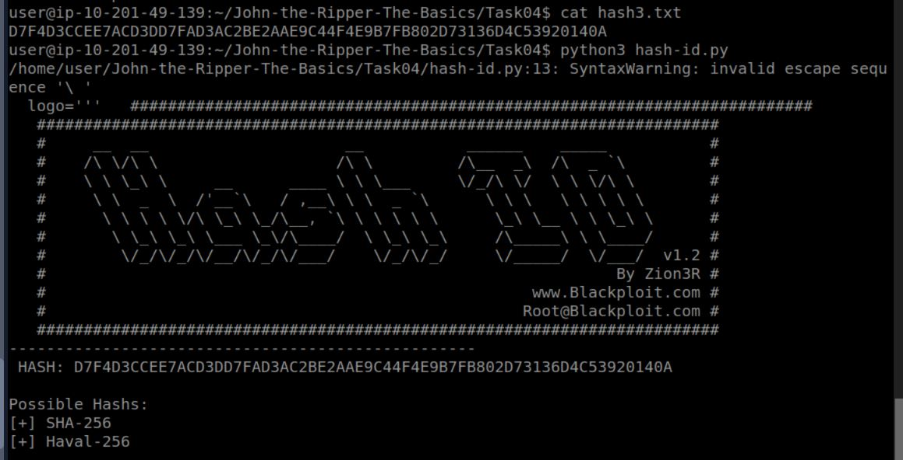
   
### 6.What is the cracked value of `hash3.txt`?
 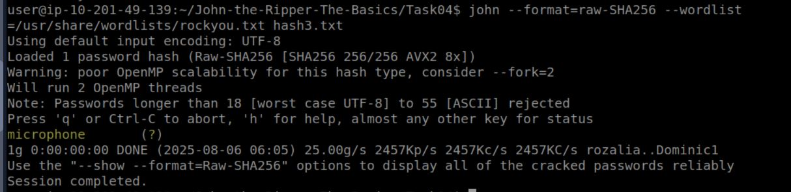

### 7. What type of hash is `hash4.txt`?
 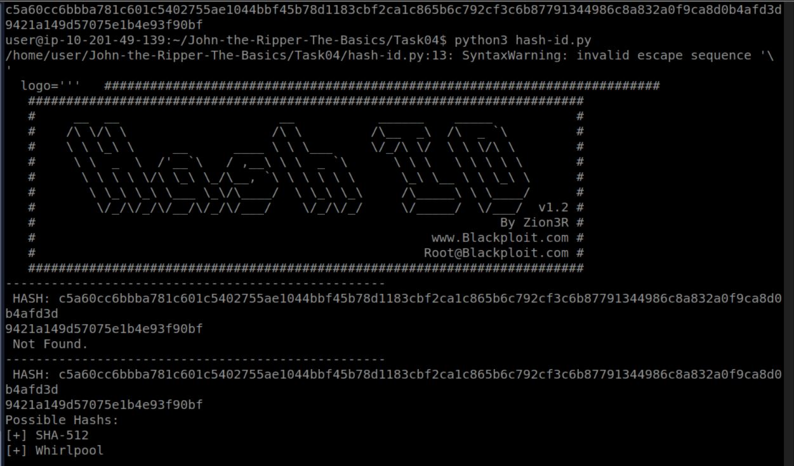
   
### 8.What is the cracked value of `hash4.txt`?
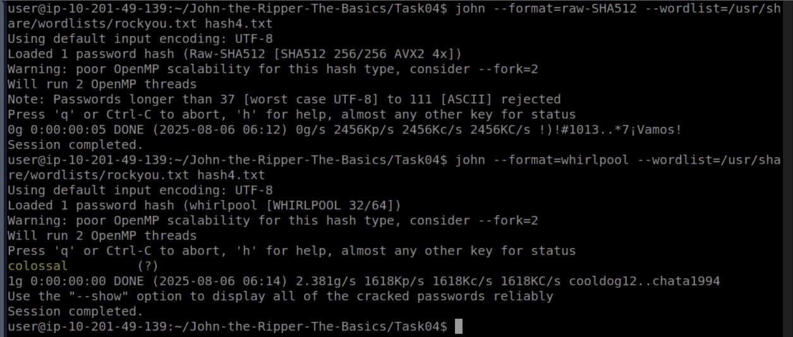

## ♟️ Task 5 : Cracking Windows Authentication Hashes

Authentication hashes are the hashed versions of passwords stored by operating systems

NTLM (NTHash) is the modern hash format used by Windows OS to store user and service passwords.
These hashes are typically stored in the SAM (Security Account Manager) database or NTDS.dit (Active Directory).
Tools can be used to dump the SAM and extract NTLM hashes.
NTLM hashes are vulnerable to brute-force attacks when passwords are weak. Obtaining them typically requires privileged access, 
such as SYSTEM-level access on a Windows machine.

#### What do we need to set the --format flag to in order to crack this hash?
      nt 
#### What is the cracked value of this password?
```bash
john --format=nt --wordlist=/usr/share/wordlists/rockyou.txt ntlm.txt
```

##### from the screenshot we can see that the cracked value of this password is mushroom
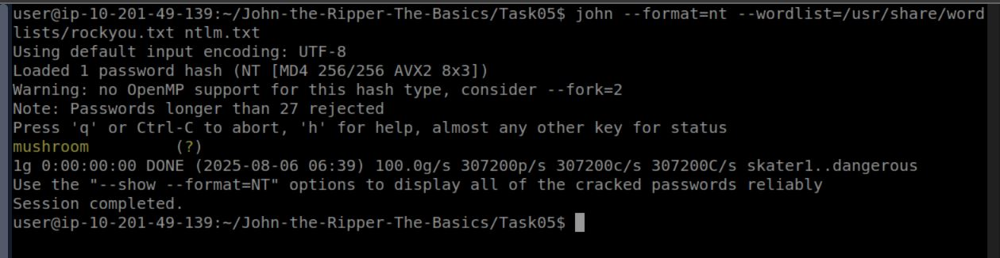

## ♟️ Task 6 : Cracking Hashes from /etc/shadow
#### What is /etc/shadow?
On Linux systems, password hashes are stored in /etc/shadow.
Only root users can read this file because it contains sensitive data.
If you gain access to this file, you can try cracking the hashes to reveal actual passwords.

#### Why do we need /etc/passwd?
John the Ripper needs both the /etc/passwd and /etc/shadow files to understand and crack the hashes.
So, we combine them using a tool called: **unshadow** , This tool merges the data from both files into one file John can read.

 Syntax: unshadow [path_to_passwd] [path_to_shadow]
 Example: unshadow local_passwd local_shadow > unshadowed.txt
 This creates a new file (unshadowed.txt) which John can then use to crack the password.

 ```bash
john --wordlist=/usr/share/wordlists/rockyou.txt --format=sha512crypt unshadowed.txt
```
#### What is the root password?
 ##### from the screenshot we can see that the cracked value of this password is 1234
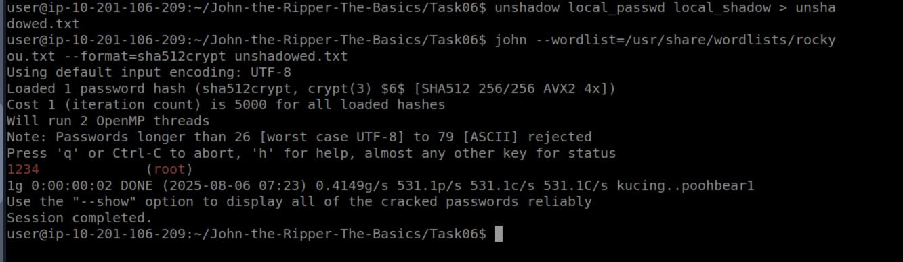

## Task 7 : Single Crack Mode

#### What is Single Crack Mode?
Single Crack Mode is a cracking technique in John the Ripper that generates password guesses based on the **username** and other account-related information (like the GECOS field). This mode is useful when passwords are derived from personal details, such as:

- `markus`
- `Markus123`
- `MARKUS!`

It uses **word mangling rules** to apply transformations to these base strings, creating many password variants.

---

#### How It Works

John the Ripper:
- Uses the **username** (and optionally, GECOS info like full name or office)
- Applies **mangling rules** to create common variants
  
On UNIX/Linux systems, John can extract extra personal information from the **GECOS field** in `/etc/passwd`. This may include:

- Full name
- Office number
- Phone numbers

John uses this information to intelligently guess passwords.

 ```bash
john --single --format=raw-md5 hash7.txt 
```
#### What is Joker’s password?
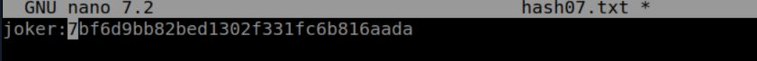
 ##### from the screenshot we can see that the cracked value of this password is Jok3r
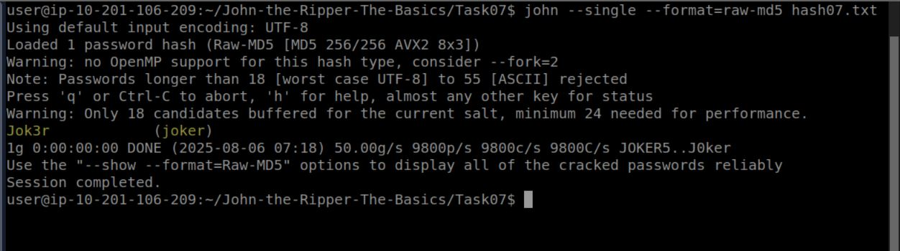

## ♟️ Task 8 : Custom rules

Custom Rules in John the Ripper let you modify words from a wordlist by adding patterns like capital letters, numbers, or symbols to match real-life passwords.
They are written in the john.conf file using actions like c (capitalize), A0 (prepend), and Az (append).

#### What do custom rules allow us to exploit?
     Password complexity predictability
#### What rule would we use to add all capital letters to the end of the word?
     Az"[A-Z]"
     
#### What flag would we use to call a custom rule called THMRules?
     --rule=THMRules

## ♟️ Task 9 :Cracking Password Protected Zip Files
zip2john is used to extract a hash from a ZIP file in a format that John the Ripper can understand.

 ```bash
zip2john secure.zip > secure.txt
```
This creates a hash file (secure.txt) which can then be cracked using John with a wordlist

 ```bash
john secure.txt --wordlist=/usr/share/wordlists/rockyou.txt
```
This process allows John to attempt password cracking on ZIP archives using dictionary attacks.
#### What is the password for the secure.zip file?

  ***pass123**

#### What is the contents of the flag inside the zip file?

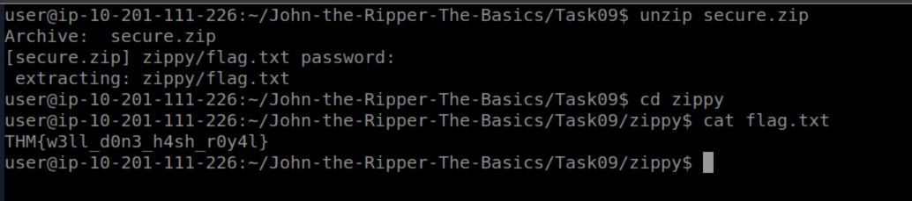

## ♟️ Task 10 : Cracking Password-Protected RAR Archives

similarly for .rar files we need to follow the same steps that we had mentioned for .zip files.

 ```bash
zip2john secure.rar > secure.txt

```
 ```bash
john secure.txt --wordlist=/usr/share/wordlists/rockyou.txt
```

#### What is the password for the secure.rar file?
  ***password***
     
#### What is the contents of the flag inside the rar file?
   ***THM{r4r_4rch1ve5_th15_t1m3}***

## ♟️ Task 11 : Cracking SSH Keys with John

convert the ssh keys into a text file using ssh2john utility and then crack the hash using john the ripper.
 ```bash

sudo apt-get install python
sudo su
sudo python /usr/share/john/ssh2john.py /home/mccleod1290/idrsa.id_rsa > id.txt
john --wordlist=/usr/share/wordlists/rockyou.txt id.txt

```

#### What is the SSH private key password?
  ***mango**

