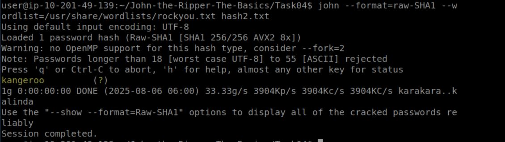

# John the Ripper: The Basics 🛡️

Welcome to my write-up for the **"Hash Cracking"** room on TryHackMe. This room introduces key cryptographic concepts and demonstrates how to crack hashes using one of the most powerful tools in cybersecurity: **John the Ripper**.

---

## ♟️ Take Aways

- What are hashes, and why are they important?
- Why hashes are considered "one-way" functions
- How password hashes can be cracked using dictionary attacks
- How to use **John the Ripper** for hash cracking
💡 Note: This write-up starts from Task 4, where the actual hands-on usage of the John the Ripper tool begins. Earlier tasks cover theory or setup steps, but Task 4 onwards dives into practical password cracking exercises.

---

##  ♟️ What is a Hash?
 A **hash** is a fixed-length string generated from data of any size using a **hashing algorithm**. Hashes are used to **protect sensitive information** like  passwords by masking the original value.
Features:
-  One-way (can’t be reversed)
-  Fixed in size (regardless of input)
-  Unique (small changes produce completely different hashes)
  
---
## ♟️ Why are hashes secure?
Hashes are considered secure because they are one-way functions—easy to compute but nearly impossible to reverse. 
Even a small change in input produces a completely different output, making it hard for attackers to guess the original data.

## ♟️ Dictonary attacks

> Take a wordlist of possible passwords

> Hash each one

> Compare it to the target hash

> If a match is found — password cracked ✅

## ♟️ rockyou.txt
rockyou.txt is a popular wordlist file that contains millions of common passwords. It’s often used in password-cracking tools like John the Ripper to guess weak passwords during dictionary attacks.

## ♟️ John The Ripper
John the Ripper is a tool used to crack passwords by guessing them from a list of common passwords. It supports dictionary, brute-force, and hybrid attacks across various hash types.

## ♟️ Task 4 : Cracking Basic Hashes

### 1. What type of hash is `hash1.txt`?
To identify the hash type 🔍:

1. Navigate to the `task04` directory.
2. Use the following command to display the contents of the file:
    ```bash
    cat hash1.txt
    ```
3. Note down the hash value displayed.
4. Run the following command to identify the hash type:
    ```bash
    python3 hash-id.py
    ```
5. Provide the noted hash value when prompted.

As you can see from the output below, the hash type is identified as **MD5**:


### 2.What is the cracked value of `hash1.txt`?

1. Navigate to the directory where `hash1.txt` resides and run the following command:

```bash
john --format=raw-md5 --wordlist=/usr/share/wordlists/rockyou.txt hash1.txt
```
As you can see from the command's output, the cracked password is:
`biscuit`


#### In a similar way , find the hash types and crack the passwords for the other files as well.

### 3. What type of hash is `hash2.txt`?
 

### 4.What is the cracked value of `hash2.txt`?
 

### 5. What type of hash is `hash3.txt`?
 
   
### 6.What is the cracked value of `hash3.txt`?
 

### 7. What type of hash is `hash4.txt`?
 
   
### 8.What is the cracked value of `hash4.txt`?


## ♟️ Task 5 : Cracking Windows Authentication Hashes


