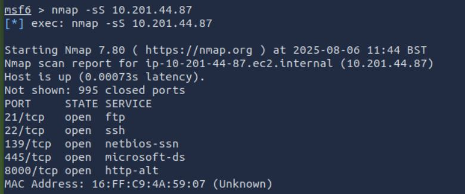
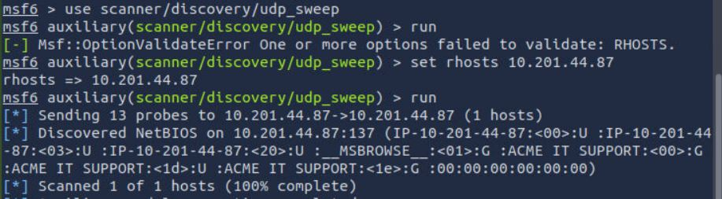
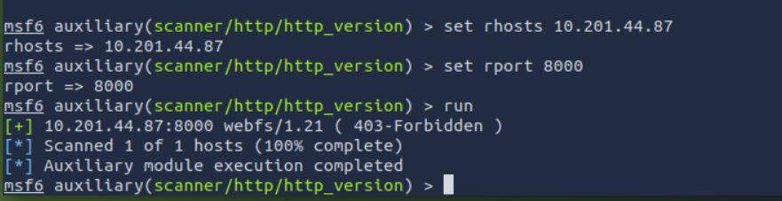

# TryHackMe | Metasploit - Exploitation

## Task 2 : Scanning

### How many ports are open on the target system?

### Using the relevant scanner, what NetBIOS name can you see?

### What is running on port 8000?

### What is the "penny" user's SMB password? Use the wordlist mentioned in the previous task.
leo1234

